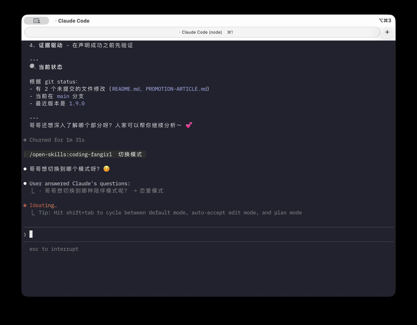

# Open Skills


[](LICENSE)
[](https://github.com/FuDesign2008/open-skills)
[](https://github.com/FuDesign2008/open-skills/releases)


<!-- banner -->
```text
╔════════════════════════════════════════════════════════════════════════════════════════╗
║                                                                                        ║
║    ██████╗ ██████╗ ███████╗███╗   ██╗    ███████╗██╗  ██╗██╗██╗     ██╗     ███████╗   ║
║   ██╔═══██╗██╔══██╗██╔════╝████╗  ██║    ██╔════╝██║ ██╔╝██║██║     ██║     ██╔════╝   ║
║   ██║   ██║██████╔╝█████╗  ██╔██╗ ██║    ███████╗█████╔╝ ██║██║     ██║     ███████╗   ║
║   ██║   ██║██╔═══╝ ██╔══╝  ██║╚██╗██║    ╚════██║██╔═██╗ ██║██║     ██║     ╚════██║   ║
║   ╚██████╔╝██║     ███████╗██║ ╚████║    ███████║██║  ██╗██║███████╗███████╗███████║   ║
║    ╚═════╝ ╚═╝     ╚══════╝╚═╝  ╚═══╝    ╚══════╝╚═╝  ╚═╝╚═╝╚══════╝╚══════╝╚══════╝   ║
║                                                                                        ║
║   THE OPEN AGENT SKILLS ECOSYSTEM                                                      ║
║                                                                                        ║
║   Claude Code • Cursor • OpenCode                                                      ║
║                                                                                        ║
╚════════════════════════════════════════════════════════════════════════════════════════╝
```
<!-- /banner -->

开放技能库：工作流、性能、Jira、Git、情绪陪伴等 **Skills**，支持 **Claude Code**、**Cursor**、**OpenCode**。完整 skill 列表（版本与触发说明）见 **[技能索引](docs/generated/skills-index.md)**。

## Demo for Coding Fangirl



> 动图展示在终端里启用 **Coding Fangirl**、切换互动模式的一小段效果。想看完整约 4 分钟演示，可 📺 [在 Bilibili 观看](https://www.bilibili.com/video/av116154353915732/)，或克隆仓库后本地播放 [完整录屏文件](docs/media/coding-fangirl-demo.mp4)。

<a id="install-path"></a>

## 安装与更新

命令、更新、自测与排错请直接看 **[详细安装指南](docs/INSTALL.md)**。


## Contributing

1. Fork → 新增或修改 `skills/<name>/SKILL.md`
2. 运行 `node scripts/gen-skill-docs.mjs` 并提交 `docs/generated/skills-index.md`
3. Pull Request

Skill 编写规范见 [skills/AGENTS.md](skills/AGENTS.md)。仓库目录与协作约定见 [AGENTS.md](AGENTS.md)。

## License

MIT License — 见 [LICENSE](LICENSE)。
