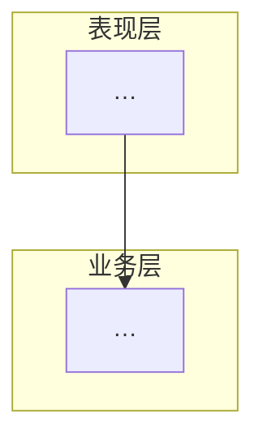
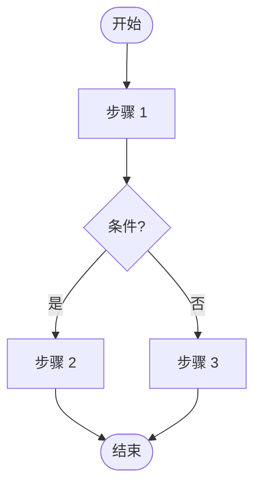

# {功能/变更名称} 技术评审

## 文档信息

| 字段 | 内容 |
|------|------|
| 评审日期 | YYYY-MM-DD |
| 评审类型 | 方案评审 / 实现评审 / 验收评审 |
| 关联文档 | 设计文档、PRD 等 |

---

## 1. 背景与目标

> **写作要求**：全员可读；不出现文件名、类名、接口名；术语首次出现须解释。

### 1.1 背景

{2–4 句：用户/业务在什么场景下遇到什么问题 → 不做的影响 → 做这件事的价值}

**必备术语**

| 术语 | 说明 |
|------|------|
| {术语 A} | {一句话定义；与本需求的关系} |

### 1.2 目标

{用结果描述，不写实现方式；用户/运营能直接感知的变化}

- {目标 1}
- {目标 2}

**成功标准**：{一句话：什么情况下视为评审/验收通过}

**明确不做（Non-Goals）**

- {不在本次范围的事项}

---

## 2. 方案总览

> **写作要求**：描述选定方案的整体协作方式；图内用业务/模块名，避免类名。只画实际需要的图。

### 2.1 方案摘要

{2–3 句：为实现 §1 目标，各端/模块如何协作；关键设计一句话概括}

### 2.2 系统拓扑图（≥2 个端/部署边界时使用）

```mermaid
flowchart TB
  subgraph Client["客户端"]
    A[桌面应用]
  end
  subgraph Server["服务端"]
    B[业务 API]
  end
  A -->|{通道说明}| B
```

**图说明**：{本图回答什么问题；产品/QA 应关注哪几条连线}

### 2.3 架构图（模块职责需要单独说明时使用，否则删除本节）



**图说明**：{主路径上的模块划分}

### 2.4 数据流图（跨端/跨模块数据传递时使用，否则删除本节）

```mermaid
flowchart LR
  S1[数据来源] -->|{数据项}| P1[处理模块]
  P1 -->|{数据项}| S2[存储/展示]
```

**图说明**：{关键数据项含义；对用户可见 vs 内部缓存}

### 2.5 逻辑流程图（主流程有分支/状态时使用，否则删除本节）



**图说明**：{关键分支的决策逻辑；与 §1 目标的关联}

---

## 3. 方案对比与选型

> **触发条件**：存在多个可行方案时 **必填**；仅单一方案则跳过整个 §3。

### 3.1 决策背景

{约束：时间、兼容性、不可改动范围 — 引用 §1 Non-Goals}

### 3.2 方案对比

| 维度 | 方案 A | 方案 B（推荐） | 方案 C |
|------|--------|---------------|--------|
| 一句话描述 | … | … | … |
| 目标达成度 | … | … | … |
| 用户体验 | … | … | … |
| 交付成本 | … | … | … |
| 风险与回滚 | … | … | … |
| 长期维护 | … | … | … |

### 3.3 选型结论

- **选定方案**：{B}
- **主要理由**：（2–4 条，对应 §1 目标与 §3.1 约束）
- **接受的代价**：（诚实写 trade-off）
- **未选方案处置**：{A/C 放弃或后续迭代}

---

## 4. 实现要点

> **写作要求**：在 §2 图景基础上展开；可出现模块名、配置项，避免代码细节。

### 4.1 改动范围

| 模块 | 改动类型 | 说明 |
|------|----------|------|
| {模块名} | 新增 / 修改 | {一句话说明} |

### 4.2 关键流程

{按主流程分小节（启动、校验、提示、持久化等）；每节 1 段 + 必要时列表。如有对外 API 变更，在此顺带说明业务语义，不单独列表。}

### 4.3 兼容与迁移

- 老版本客户端：…
- 老数据/配置：…
- 降级策略：…

---

## 5. 风险与边界

### 5.1 风险清单

| 风险 | 影响 | 概率 | 缓解措施 |
|------|------|------|----------|
| … | … | 高/中/低 | … |

### 5.2 已知限制

{不测什么、不支持什么场景 — QA 与产品需确认}

### 5.3 安全与合规（如适用，否则删除本节）

{权限、数据出境、敏感信息}

---

## 6. 发布与运维（如适用，否则删除本节）

> **触发条件**：涉及灰度发布策略或服务端刷数据时填写；否则跳过整个 §6。

### 6.1 灰度策略

{灰度比例、观察指标、回滚触发条件}

### 6.2 服务端数据迁移

{刷数据范围、执行时机、验证方式、回滚方案}

---

## 7. 结论

- **评审结论**：{✅ 通过 / ⚠️ 有条件通过 / ❌ 不通过 / 🔄 挂账待补}
- **关键决策**：{1–2 句话总结}
- **Action Items**：
  - {负责人：事项，截止时间}

---

## 模板使用说明（填写完成后删除本节）

| 章节 | 方案评审 | 实现评审 | 验收评审 |
|------|----------|----------|----------|
| §1 背景与目标 | 必填 | 必填 | 必填 |
| §2 图示 | 必填 | 推荐 | 可选 |
| §3 方案对比 | 多方案必填 | 已决策可简述 | 可省略 |
| §4 实现要点 | 概要 | 必填 | 对照用 |
| §5 风险与边界 | 必填 | 必填 | 必填 |
| §6 发布与运维 | 涉及灰度/刷数据时填 | 同左 | 同左 |
| §7 结论 | 必填 | 必填 | 必填 |
